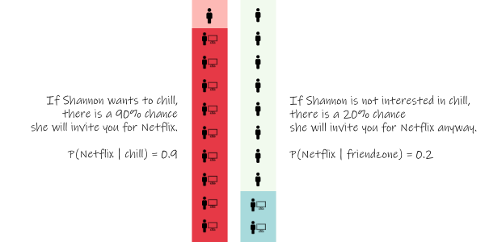
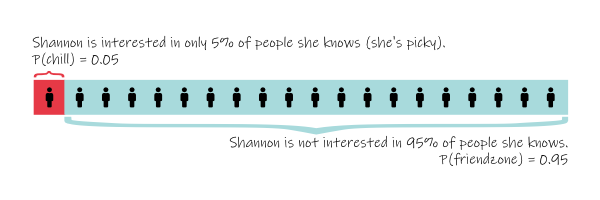

### This is Shannon.

You're secretly in love with Shannon. You guys are friends, though you have no idea if Shannon is into you. Shannon typically shows no interest in 95% of people. However when she is interested and wants to "chill" with someone, she would invite them over for Netflix 90% of the time. 

One day, Shannon invites you over for "Netflix". You are super excited, but you realize you're not sure if this means anything. Maybe she actually wants to watch Tiger King with someone and sees you as just a friend. But knowing Shannon, you remember that she doesn't like watching stuff together with people, and typically doesn't invite "just friends" over alone for Netflix. You think there's only a 20% chance she asks a friend she has no interest in to watch Netflix.

## Is Shannon inviting you over for chill, or just Netflix?

At first it seems highly likely Shannon wants to chill. After all, there is a 90% chance of her inviting you for Netflix if she's into you, and only a 20% chance of a false positive.

However, given the current information its actually **statistically far more likely you're going to end up just watching Netflix.** Why? Because of the [base rate fallacy](https://en.wikipedia.org/wiki/Base_rate_fallacy).

Assuming we have no additional information about whether Shannon wants to chill with you, we need to consider the base rate of how likely it is for Shannon to want to chill (5%), compared to the chance of being just a friend (95%).

We can now formalize how to obtain the likelihood of chill, given that Shannon has invited you to Netflix with a formula elegantly defined with **Bae's theorem.**
 ## Bae's theorem

Bae's theorem can be defined as:  
  
$$
P(chill \mid netflix) = \frac{P(netflix \mid chill) \, P(chill)}{P(netflix)}
$$

>### Bae's theorem: Given evidence of interest, we should update our beliefs on the hypothesis that our person of interest will become bae.  

The key underlying concept here is that your information should not be evaluated in a vacuum -- they should update your prior beliefs. The information that there is a 90% chance Shannon will invite you to watch Netflix if Shannon is interested in you must **update**, not replace, the prior belief that she is not interested in 95% of people. To better understand this intuitively, let's visualize this in context. Take a hypothetical 20 people around Shannon (that she's wants to chill with or just friends), and the last 10 times Shannon invited them to do something together (netflix or not netflix).

### Bae's theorem visualization

<iframe  class="iframe-1"  src="https://www.colorsandcode.com/bayes-theorem-assets/bayes.html" scrolling="no"></iframe>

Given our assumption that Shannon only wants to chill with 5% of people P(chill) = 0.05, that means in our hypothetical group of 20, we would expect her to only be interested in 1 out of the 20.

If she invites this person to watch Netflix 90% of the time, out of 10 hangouts we'd expect 9 true positives of Netflix and chill.

But with the 19 other friends that she will watch Netflix with 20% of time, out of 10 hangouts each we get 38 false positives of Netflix and no chill.

It then follows that out of the 47 total times Shannon invited someone to watch Netflix, only 9 of them were with someone she wanted to chill with. Given that she invites you watch Netflix, there's only a 9/47 = ~19% chance that means she wants to chill.

### Conclusion: If Shannon invites you to watch Netflix, you're probably just watching Netflix.

----
Realistically, the chance of chill is typically not independent and random, and is heavily correlated with prior interactions. You may have other signals or reasons to believe Shannon is interested. In a future post, we will look at independence and what happens when we factor in additional information.*   

*Results not guaranteed

Learn more about Bayes' theorem:  
[Bayes Theorem - 3blue1brown](https://www.youtube.com/watch?v=HZGCoVF3YvM)  
[The Bayesian Trap - Veritasium](https://www.youtube.com/watch?v=R13BD8qKeTg&t=302s)  
