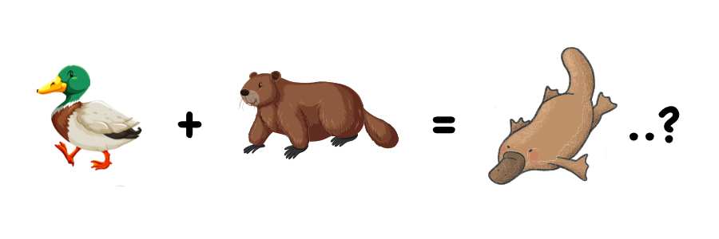

The platypus has a unique combination of features -- beak of a duck, fur of an otter, tail of a beaver, among many others. This mix is so bizarre that initially scientists thought its very existence must have been a hoax. "It naturally excites the idea of some deceptive preparation by artificial means," English zoologist George Shaw wrote in 1799. He even cut the pelt with scissors in a vain attempt to try and find the stitches that attached the bill to the pelt.

Given it's unique amalgamation of traits, how should a platypus apply for a job? Despite being a jack of many trades, it is certainly master of none. If the job required only the fastest swimmers, it wouldn't stand a chance against sailfish and swordfish. If it were a competition to be the most venomous, its going to lose out to the box jellyfish and many others. Worst yet, if you were to evaluate a platypus by its ability to sing like songbirds, it might even start to lose self-esteem and think it'll never find gainful employment.

 
Instead, imagine how a platypus might successfully pitch himself for a job. "Not only can I swim, but I can poison enemies and see underwater with electroreception!"

Remember that the intersection of your skills is what makes you unique.
Don't judge a platypus by its ability to sing a song. 