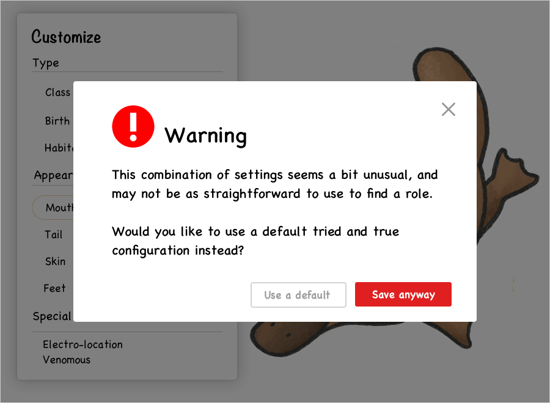

I've been thinking about how we present ourselves to appeal to others professionally, both as a job seeker and interviewer. 

When I graduated college looking for my first job, the conventional wisdom was to *check the boxes*. I would research the companies and teams extensively, figure out what qualities they were looking for, and made it a point to demonstrate all of those competencies in my interviews. I would look at portfolios of "successful" designers and model my portfolio after theirs. I made sure to cover all the bases -- mobile, research, visuals, interaction, etc.

As an interviewer and mentor, now I see a plethora of cookie cutter portfolios that check all the boxes listed, each complete with case studies that demonstrate a thoughtful design thinking process, and showcasing a range of design skills and SEO buzzwords. *Check.* But what about beyond that? What about the boxes not listed?

People hire individuals, not websites.

## What makes you different?

**The platypus is unique.**

It possesses the beak of a duck, fur of an otter, and tail of a beaver. It is a mammal, yet it lays eggs. It is venomous and can "see" underwater using a radar-like electro-location.

This mix is so bizarre that initially scientists thought its very existence must have been a hoax. "It naturally excites the idea of some deceptive preparation by artificial means," English zoologist George Shaw wrote in 1799. He even cut the pelt with scissors in a vain attempt to try and find the stitches that attached the bill to the pelt.

Given it's unique amalgamation of traits, how would you recommend a platypus apply for a job?

Although a jack of many trades, it is not particularly a master in each one. If the job required the fastest swimmer, its not as competitive as a sailfish or swordfish. If the job needed the most deadly venom, it would be outdone by a pufferfish or box jellyfish. Despite its beaver tail, if the job involved building a dam, a real beaver would certainly construct a better structure. If you were to evaluate a platypus by its aptitude in flying like a duck, it might even start to lose self-esteem and think it'll never find gainful employment.

 
Instead, imagine how a platypus might successfully pitch itself:

>  **"Not only can I swim, but I can poison enemies and see underwater
> with electroreception!"**

Now who else can do that? 

Instead of shoehorning itself into a mold of a duck, it would be way better off emphasizing its own strengths. Even though it can compete with the beak, it can't fly and it can't quack. If it doesn't fly like a duck or quack like a duck, maybe its not meant to be a duck.

The platypus's unique combination is its best selling point. Nothing else even comes close in terms of being good at its combination of traits. The intersection of its unique qualities is its superpower.

## What is your superpower?

How have your unique experiences and interests shaped your views and perspectives? What unique blend of skills do you bring to the table?

As a visual designer, I don't stand out.

I can code prototypes, but not nearly as skilled as engineers in writing production quality code.

I understand statistics, but there are millions of people better at conducting analyses or training machine learning models than me.

But as a designer-coder with a quant background and a passion for visualizing information, now things start to get more interesting. Its rarer to find designers strong in both left-brain and right-brain skillsets. There are plenty of fintech or data-driven companies that would find this kind of background appealing. For instance, a designer who can think quantitatively may better understand the nuances of the domain and product requirements, and a designer who understands code may be more efficient to work with developers.

## But if I don't try to be what companies are asking for, how will I get hired?

In dating we often hear the advice to "be yourself." By being yourself, you have a much higher chance of actually finding a match that is the best fit for you. You might match with less people/companies, but those matches will likely be a better fit, and have a much greater chance of working out well in the long term. After all, you only need one job (and one significant other, typically). 

Granted, if "being yourself" means that you don't shower and can't hold a conversation, you might have a harder time finding a match. There is a baseline that underscores the matchmaking process. I prefer the modified version of "be yourself" -- **become your best self**. If the version of yourself today doesn't meet the bar of who you want to be with or where you want to work, then you'll have to put in the effort to upgrade into a better iteration of yourself. Spend the time to learn the necessary skills and expertise.

Be authentic to your own passions and experiences. You can only fake things for so long, and pretending to be something that you're not is often an exhausting, non-viable strategy for the long term. The intersection of your skills, passions, and experiences is what makes you unique, and can be your greatest asset. 

A platypus may not make for the best duck, beaver, or otter. But a duck, beaver, or otter will never be able to out-platypus the platypus.

----

Inspired by a post from [Julie Zhuo's The Looking Glass](https://lg.substack.com/p/the-looking-glass-candidates-companies)