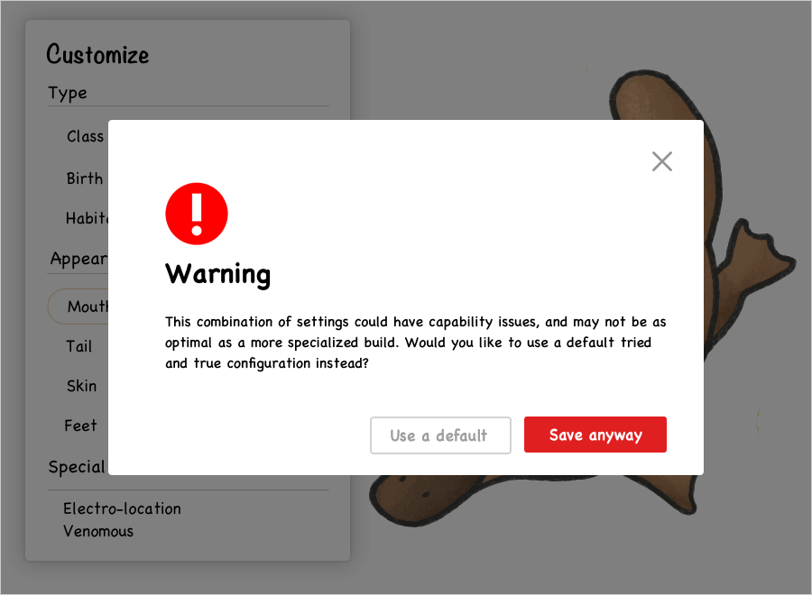

I've been thinking about how we present our best selves to appeal to others professionally, as both a job seeker and interviewer. 

When I graduated college looking for my first job, the conventional wisdom thrown around was to *check the boxes*. I would look at portfolios of "successful" designers and model my portfolio after theirs. I would research the companies and teams extensively, figure out what qualities they were looking for, and made it a point to demonstrate all of those competencies in my interviews.

As an interviewer and mentor, now I see a plethora of cookie cutter portfolios that check all the boxes listed, each complete with case studies that demonstrate a thoughtful design thinking process, and showcasing a range of interaction, visual, UX, research, and other design skills. *Check.* But what about beyond that? What about the boxes not listed?

**What makes you different?**

## The platypus is unique.

It possesses the beak of a duck, fur of an otter, and tail of a beaver. It is a mammal, yet it lays eggs. It is venomous and can "see" underwater using a radar-like electro-location.

This mix is so bizarre that initially scientists thought its very existence must have been a hoax. "It naturally excites the idea of some deceptive preparation by artificial means," English zoologist George Shaw wrote in 1799. He even cut the pelt with scissors in a vain attempt to try and find the stitches that attached the bill to the pelt.

Given it's unique amalgamation of traits, how would you recommend a platypus apply for a job?

Despite being a jack of many trades, it is certainly master of none. If the job required only the fastest swimmers, it wouldn't stand a chance against sailfish and swordfish. If it were a competition to be the most venomous, its going to lose out to the box jellyfish and many others. Worst yet, if you were to evaluate a platypus by its ability to sing like songbirds, it might even start to lose self-esteem and think it'll never find gainful employment.

 
Instead, imagine how a platypus might successfully pitch himself for a job:

>  **"Not only can I swim, but I can poison enemies and see underwater
> with electroreception!"**

You wouldn't recommend it shoehorn itself into a mold of a duck. It doesn't have feathers, it has the fur of an otter.

Nor would you ask it to pretend to be a pufferfish, because despite it being venomous it cant do the cool puffing up thing.

Its unique combination is its best selling point. Nothing else even comes close in terms of being good at its combination of traits. The intersection of qualities is its superpower.

**What is your superpower?**

How have your unique experiences and interests shaped your views and perspectives? What unique blend of skills do you bring to the table?

As a visual designer, I don't stand out.

I can code prototypes, but not nearly as skilled as engineers in writing production quality code.

I understand statistics, but there are millions of people better at conducting analyses or training machine learning models than me.

But as a designer-coder with a quant background and a passion for visualizing information, now things start to get more interesting. Its rarer to find designers strong in both left-brain and right-brain skillsets. There are plenty of fintech or data-driven companies that would find this kind of background appealing. For instance, a designer who can think quantitatively may better understand the nuances of the domain and product requirements, and a designer who understands code may be more efficient to work with developers.

## But if I don't try to be what companies are asking for, won't I not get hired?

In dating we often hear the advice to "be yourself." But if "being yourself" means that you don't shower and can't hold a conversation, you might have a harder time finding a date. The reality is that there is a baseline that underscores the matchmaking process in both dating and the professional world. 

I prefer the modified version of "be yourself" -- **be your best self**. If the version of yourself today doesn't meet the bar of who you want to be with or where you want to work, then you'll have to put in the effort to upgrade into a better iteration of yourself. Spend the time to learn the necessary skills and expertise. Be authentic to your own passions and experiences. You can only fake things for so long, and pretending to be something that you're not just to fit the mold of where you think you want to be can be exhausting. 

While you might find that this approach limits yourself to fewer options, those options end up being of a higher caliber and a greater chance of success. **You only need one job** (and one significant other, typically). By being your best self, you have a much higher chance of actually finding a match that is the best fit for you. 

The intersection of your skills, passions, and experiences is what makes you unique, and can be your greatest superpower. A platypus may not make for the best duck, beaver, or otter. But a duck, beaver, or otter will never be able to out-platypus the platypus.